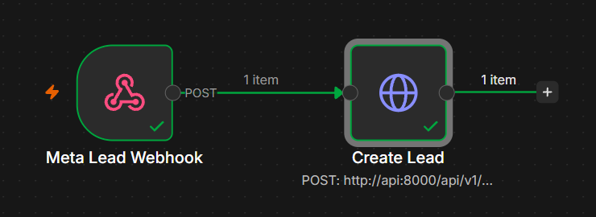
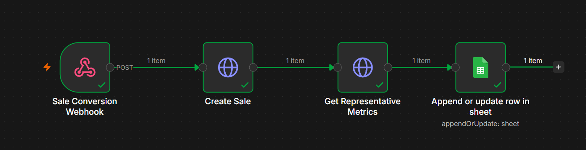
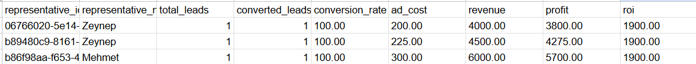

# Lead Sales Automation

A production-deployed proof of concept for a real RevOps question: **did a lead acquired through Meta Ads become a sale, and what is the assigned sales representative's cost/profitability?**

The project demonstrates an end-to-end automation built with **n8n, Python/FastAPI, PostgreSQL and Google Sheets**, with an interactive live RevOps dashboard for testing the flow.

## Production demo

| Lead ingestion | Sale conversion & metrics |
| --- | --- |
|  |  |

**Live reporting output**



The screenshots above show the deployed flow processing synthetic production-test data end to end.

## Live demo

- **Interactive RevOps dashboard:** https://lead-sales-automation-production.up.railway.app/dashboard
- API health: https://lead-sales-automation-production.up.railway.app/health
- Swagger / OpenAPI: https://lead-sales-automation-production.up.railway.app/docs
- n8n is deployed on Railway and the workflows are published. Public write-webhook URLs are intentionally not advertised here.

> The demo uses synthetic data only. No real customer or patient data is stored in this repository.

## Architecture

```text
Simulated Meta Lead
       |
       v
 n8n Webhook
       |
       v
 FastAPI / Python
       |
       v
   PostgreSQL
       |
       +----> Sale conversion
       |
       +----> Representative metrics
                    |
                    v
               Google Sheets
```

**FastAPI** owns the business rules and profitability calculations. **PostgreSQL** is the source of truth. **n8n** is the integration/orchestration layer, while **Google Sheets** is a reporting destination.

Production services are deployed on Railway with persistent PostgreSQL and n8n storage.

## End-to-end flow

1. A simulated Meta lead reaches the published n8n webhook.
2. n8n forwards the normalized payload to FastAPI.
3. FastAPI persists the lead and assigned representative in PostgreSQL.
4. When the lead converts, a second n8n webhook records the sale using the external `meta_lead_id`.
5. FastAPI calculates the representative's latest conversion and profitability metrics.
6. n8n upserts those metrics into Google Sheets using `representative_id` as the key.\n7. The live dashboard reads aggregate and recent-lead data from FastAPI and refreshes automatically. Demo controls can create synthetic leads and convert open leads through the published n8n workflows.

### Lead example

```json
{
  "lead_id": "META-1042",
  "campaign": "dental-treatment-istanbul",
  "ad_cost": 120.00,
  "representative": "Ayse"
}
```

Lead ingestion is idempotent by `meta_lead_id`, so webhook retries do not create duplicate leads.

### Sale example

```json
{
  "meta_lead_id": "META-1042",
  "revenue": 2500.00
}
```

The conversion workflow resolves the lead by its external Meta ID, records the sale, marks the lead as won and requests the latest representative metrics.

## Metrics

For each sales representative the API calculates:

- total leads
- converted leads
- conversion rate = converted leads / total leads
- allocated advertising cost
- sales revenue
- profit = revenue - advertising cost
- ROI = profit / advertising cost x 100

For this PoC, `ad_cost` is a synthetic/allocated acquisition cost per lead. In a real Meta Lead Ads integration, campaign/ad-set spend would normally be retrieved from Meta Ads reporting/Insights data and allocated to leads according to the chosen attribution model.

## Google Sheets reporting

The production n8n workflow uses **Append or Update Row**, matched on `representative_id`. This keeps one current performance row per representative instead of creating duplicate snapshots.

Columns:

```text
representative_id | representative_name | total_leads | converted_leads |
conversion_rate | ad_cost | revenue | profit | roi
```

Google OAuth credentials, spreadsheet identifiers and secrets are deliberately not committed.

## API

- `GET /health`
- `GET /api/v1/leads/recent`\n- `POST /api/v1/leads`
- `POST /api/v1/leads/{lead_id}/sale`
- `POST /api/v1/leads/by-meta/{meta_lead_id}/sale`
- `GET /api/v1/analytics/representatives/{representative_id}`\n- `GET /api/v1/analytics/dashboard`

Interactive documentation is available in the live Swagger deployment linked above.

## Engineering decisions

- **Idempotent lead ingestion:** repeated Meta webhook delivery does not duplicate a lead.
- **External-ID conversion:** n8n can convert a lead using its Meta ID without knowing an internal database UUID.
- **One sale per lead:** duplicate conversion attempts are rejected.
- **Decimal money values:** financial calculations avoid binary floating-point arithmetic.
- **Separated layers:** API routes, services, repositories and persistence models have distinct responsibilities.
- **Database as source of truth:** Sheets is reporting output, not application state.
- **Persistent automation runtime:** production n8n data is stored on a Railway volume.
- **Secrets outside Git:** database, n8n encryption and Google OAuth credentials are environment/configuration concerns.
- **Synthetic data only:** no real customer or patient information is used.

## Run locally

Requirements: Docker and Docker Compose.

```bash
docker compose up --build
```

Local services:

- FastAPI: `http://localhost:8000`
- Swagger: `http://localhost:8000/docs`
- n8n: `http://localhost:5678`

The API container runs `alembic upgrade head` before startup, so the PostgreSQL schema is created automatically.

Import the workflow templates from:

```text
n8n/meta-lead-workflow.json
n8n/sale-conversion-workflow.json
```

The committed workflow templates do not contain Google credentials. Configure the Google Sheets reporting node in your own n8n instance.

## Tests

```bash
pytest -q
```

Tests cover API health, duplicate lead ingestion, conversion behavior and profitability calculations.

## Tech stack

**Python 3.11 · FastAPI · SQLAlchemy 2 · PostgreSQL 16 · Alembic · n8n · Google Sheets · Docker Compose · Pytest · Railway**

## Scope

This project intentionally focuses on the automation requested by the use case rather than adding an unnecessary AI/LLM layer. The core problem is deterministic workflow orchestration, persistence and profitability calculation.
